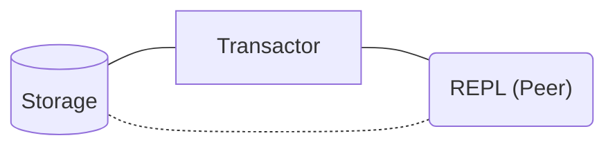

# Datomic Pro for Docker

Setting up Datomic Pro for Docker with Docker Compose.


> _As of April 27, 2023, [Datomic Pro is free](https://blog.datomic.com/2023/04/datomic-is-free.html)!_

_This is not an official Datomic project or documentation and is not affiliated with Datomic in any way._

## TL;DR and Quick Start

```bash
git clone https://github.com/gbaptista/datomic-pro-docker.git

cd datomic-pro-docker

cp compose/postgresql.yml docker-compose.yml

docker compose up -d datomic-storage

docker compose run datomic-tools psql \
  -f bin/sql/postgres-table.sql \
  -h datomic-storage \
  -U datomic-user \
  -d my-datomic-storage

docker compose up -d datomic-transactor

docker compose run datomic-tools clojure -M -e "$(cat <<'CLOJURE'
  (require '[datomic.api :as d])
  (d/create-database "datomic:sql://my-datomic-database?jdbc:postgresql://datomic-storage:5432/my-datomic-storage?user=datomic-user&password=unsafe")
  (System/exit 0)
CLOJURE
)"
```

```bash
docker compose run datomic-tools clojure -M:repl
```



```clojure
(require '[datomic.api :as d])

(def conn (d/connect "datomic:sql://my-datomic-database?jdbc:postgresql://datomic-storage:5432/my-datomic-storage?user=datomic-user&password=unsafe"))

@(d/transact conn [{:db/ident       :book/title
                    :db/valueType   :db.type/string
                    :db/cardinality :db.cardinality/one
                    :db/doc         "The title of the book."}

                   {:db/ident       :book/genre
                    :db/valueType   :db.type/string
                    :db/cardinality :db.cardinality/one
                    :db/doc         "The genre of the book."}])

@(d/transact conn [{:db/id      -1
                    :book/title "The Tell-Tale Heart"
                    :book/genre "Horror"}]

(def db (d/db conn))

(d/q '[:find ?e ?title ?genre
       :where [?e :book/title ?title]
              [?e :book/genre ?genre]]
     db)
```

## Index

- Todo

## Flavors

### Dev Mode


## Utilities

- [Storage Services and Transactor](#storage-services-and-transactor)
  - [Dev Mode](#dev-mode)
  - [PostgreSQL](#postgresql)
- [Tools and Utilities](#tools-and-utilities)
  - [Datomic Console](#datomic-console)
  - [REPL](#repl)
- [Peer Server](#peer-server)

## Storage Services and Transactor

Official Documentation: [Setting up Storage Services](https://docs.datomic.com/operation/storage.html)

### Dev Mode

Official Documentation: [Dev Mode](https://docs.datomic.com/operation/storage.html#dev-mode)

Copy the Docker Compose file:

```sh
cp compose/dev-mode.yml docker-compose.yml
```

Run the Datomic Transactor:

```sh
docker compose up datomic-transactor
```

To restore a backup of the [MusicBrainz](https://musicbrainz.org) Sample Database:

```sh
docker compose run datomic-tools ./bin/datomic restore-db file:/usr/mbrainz-1968-1973 "datomic:dev://datomic-transactor:4334/my-datomic-database?password=unsafe"
````

### PostgreSQL

Official Documentation [SQL Database](https://docs.datomic.com/operation/storage.html#sql-database)

Copy the Docker Compose file:

```sh
cp compose/postgresql.yml docker-compose.yml
```

Run the Datomic Storage Service (PostgreSQL):

```sh
docker compose up datomic-storage
```

Create the table for Datomic:

```sh
docker compose run datomic-tools psql -f bin/sql/postgres-table.sql -h datomic-storage -U datomic-user -d my-datomic-storage
```

You will be prompted for a password, which is `unsafe`.

Run the Datomic Transactor:

```sh
docker compose up datomic-transactor
```

To restore a backup of the [MusicBrainz](https://musicbrainz.org) Sample Database:

```sh
docker compose run datomic-tools ./bin/datomic restore-db file:/usr/mbrainz-1968-1973 "datomic:sql://my-datomic-database?jdbc:postgresql://datomic-storage:5432/my-datomic-storage?user=datomic-user&password=unsafe"
````

## Tools and Utilities

### Datomic Console

To run [Datomic Console](https://docs.datomic.com/resources/console.html):

```sh
docker compose up datomic-console
```

http://localhost:8080/browse


### REPL

Starting a REPL:
```sh
docker compose run datomic-tools clojure -M:repl
````

Documentation: [Getting Started](https://docs.datomic.com/peer-tutorial/connect-to-a-database.html)

Require the API and set the appropriate `db-uri`:

```clojure
(require '[datomic.api :as d])

; If you are using Dev Mode:
(def db-uri "datomic:dev://datomic-transactor:4334/my-datomic-database/?password=unsafe")

; If you are using PostgreSQL:
(def db-uri "datomic:sql://my-datomic-database?jdbc:postgresql://datomic-storage:5432/my-datomic-storage?user=datomic-user&password=unsafe")
```

If you have restored a backup of the [MusicBrainz](https://musicbrainz.org) sample database:
```clj
(def conn (d/connect db-uri))

(def db (d/db conn))

(d/q '[:find ?id ?type ?gender
         :in $ ?name
       :where
         [?e :artist/name ?name]
         [?e :artist/gid ?id]
         [?e :artist/type ?teid]
         [?teid :db/ident ?type]
         [?e :artist/gender ?geid]
         [?geid :db/ident ?gender]]
     db
    "Jimi Hendrix")
```

If you are creating a new database from scratch:

```clj
(d/create-database db-uri)

(def conn (d/connect db-uri))

@(d/transact conn [{:db/doc "Hello world"}])

@(d/transact conn [{:db/ident :movie/title
                    :db/valueType :db.type/string
                    :db/cardinality :db.cardinality/one
                    :db/doc "The title of the movie"}

                   {:db/ident :movie/genre
                    :db/valueType :db.type/string
                    :db/cardinality :db.cardinality/one
                    :db/doc "The genre of the movie"}

                   {:db/ident :movie/release-year
                    :db/valueType :db.type/long
                    :db/cardinality :db.cardinality/one
                    :db/doc "The year the movie was released in theaters"}])

@(d/transact conn [{:movie/title "The Goonies"
                    :movie/genre "action/adventure"
                    :movie/release-year 1985}
                   {:movie/title "Commando"
                    :movie/genre "action/adventure"
                    :movie/release-year 1985}
                   {:movie/title "Repo Man"
                    :movie/genre "punk dystopia"
                    :movie/release-year 1984}])

(def db (d/db conn))

(d/q '[:find ?e ?movie-title
       :where [?e :movie/title ?movie-title]]
     db)
```


To exit the REPL, press Ctrl+D or type:
```clojure
:repl/quit
```

Sometimes the REPL insists on hanging; in that case, you can kill the container:
```sh
docker compose kill datomic-tools
```

## Peer Server

After having a database created or restored, you can boot a Peer Server:
```sh
docker compose up datomic-peer-server
```

With the Peer Server running, you can start a REPL and connect to it:

```sh
docker compose run datomic-tools clojure -M:repl
```

```clojure
(require '[datomic.client.api :as d])

(def client (d/client
              {:server-type :peer-server
               :endpoint    "datomic-peer-server:8998"
               :secret      "unsafe-secret"
               :access-key  "unsafe-key"
               :validate-hostnames false}))

(def conn (d/connect client {:db-name "my-datomic-database"}))

(def db (d/db conn))
```

If you created a new database from scratch:

```clj
(d/q '[:find ?e ?movie-title
       :where [?e :movie/title ?movie-title]]
     db)
```

If you have restored a backup of the [MusicBrainz](https://musicbrainz.org) sample database:
```clj
(d/q '[:find ?id ?type ?gender
         :in $ ?name
       :where
         [?e :artist/name ?name]
         [?e :artist/gid ?id]
         [?e :artist/type ?teid]
         [?teid :db/ident ?type]
         [?e :artist/gender ?geid]
         [?geid :db/ident ?gender]]
     db
    "Jimi Hendrix")
```

## Clojure Dependencies

- [org.clojure/clojure](https://central.sonatype.com/artifact/org.clojure/clojure/overview)
- [com.datomic/peer](https://central.sonatype.com/artifact/com.datomic/peer/overview)
- [com.datomic/client-pro](https://central.sonatype.com/artifact/com.datomic/client-pro/overview)
- [org.postgresql/postgresql](https://central.sonatype.com/artifact/org.postgresql/postgresql)
- [org.slf4j/slf4j-simple](https://central.sonatype.com/artifact/org.slf4j/slf4j-simple)
- [com.bhauman/rebel-readline](https://clojars.org/com.bhauman/rebel-readline)
