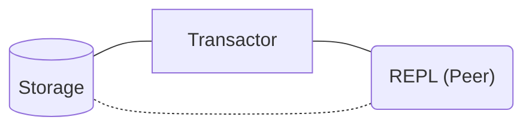
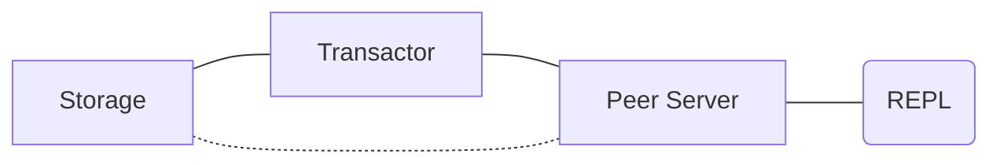
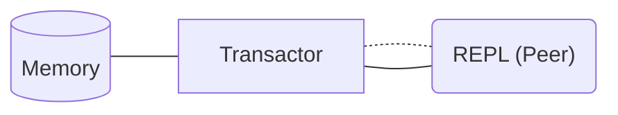
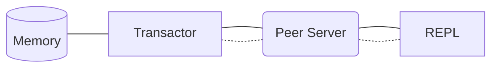

# Datomic Pro for Docker

Setting up Datomic Pro for Docker with Docker Compose.


> _As of April 27, 2023, [Datomic Pro is free](https://blog.datomic.com/2023/04/datomic-is-free.html)!_

_This is not an official Datomic project or documentation and is not affiliated with Datomic in any way._

## TL;DR and Quick Start

Assuming you want to use PostgreSQL as your storage service:

```bash
git clone https://github.com/gbaptista/datomic-pro-docker.git

cd datomic-pro-docker

cp compose/datomic-postgresql.yml docker-compose.yml

docker compose up datomic-storage

docker compose run datomic-tools psql \
  -h datomic-storage \
  -U datomic-user \
  -d my-datomic-storage \
  -c 'CREATE TABLE datomic_kvs (
        id TEXT NOT NULL,
        rev INTEGER,
        map TEXT,
        val BYTEA,
        CONSTRAINT pk_id PRIMARY KEY (id)
      );'

# password: unsafe

docker compose up datomic-transactor

docker compose run datomic-tools clojure -M -e "$(cat <<'CLOJURE'
  (require '[datomic.api :as d])
  (d/create-database "datomic:sql://my-datomic-database?jdbc:postgresql://datomic-storage:5432/my-datomic-storage?user=datomic-user&password=unsafe")
  (System/exit 0)
CLOJURE
)"
```

```bash
docker compose run datomic-tools clojure -M:repl
```



```clojure
(require '[datomic.api :as d])

(def connection (d/connect "datomic:sql://my-datomic-database?jdbc:postgresql://datomic-storage:5432/my-datomic-storage?user=datomic-user&password=unsafe"))

@(d/transact connection
  [{:db/ident       :book/title
    :db/valueType   :db.type/string
    :db/cardinality :db.cardinality/one
    :db/doc         "The title of the book."}

    {:db/ident       :book/genre
    :db/valueType   :db.type/string
    :db/cardinality :db.cardinality/one
    :db/doc         "The genre of the book."}])

@(d/transact connection
  [{:db/id      -1
    :book/title "The Tell-Tale Heart"
    :book/genre "Horror"}])

(def database (d/db connection))

(d/q '[:find ?e ?title ?genre
       :where [?e :book/title ?title]
              [?e :book/genre ?genre]]
     database)

; #{[4611681620380877802 "The Tell-Tale Heart" "Horror"]}

(System/exit 0)
```

## Index

{index}

## Flavors

### PostgreSQL as Storage Service

#### Run PostgreSQL as the Storage Service

```sh
cp compose/datomic-postgresql.yml docker-compose.yml

docker compose up datomic-storage
```

Create the table for Datomic databases:

```bash
docker compose run datomic-tools psql \
  -h datomic-storage \
  -U datomic-user \
  -d my-datomic-storage \
  -c 'CREATE TABLE datomic_kvs (
        id TEXT NOT NULL,
        rev INTEGER,
        map TEXT,
        val BYTEA,
        CONSTRAINT pk_id PRIMARY KEY (id)
      );'
```

You will be prompted for a password, which is `unsafe`.

#### Run the Transactor

```sh
docker compose up datomic-transactor
```

#### Create a Database

```sh
docker compose run datomic-tools clojure -M -e "$(cat <<'CLOJURE'
  (require '[datomic.api :as d])
  (d/create-database "datomic:sql://my-datomic-database?jdbc:postgresql://datomic-storage:5432/my-datomic-storage?user=datomic-user&password=unsafe")
  (System/exit 0)
CLOJURE
)"
```

#### Transact and Query through an Embedded Peer

```bash
docker compose run datomic-tools clojure -M:repl
```


```clojure
(require '[datomic.api :as d])

(def connection (d/connect "datomic:sql://my-datomic-database?jdbc:postgresql://datomic-storage:5432/my-datomic-storage?user=datomic-user&password=unsafe"))

@(d/transact connection
  [{:db/ident       :book/title
    :db/valueType   :db.type/string
    :db/cardinality :db.cardinality/one
    :db/doc         "The title of the book."}

   {:db/ident       :book/genre
    :db/valueType   :db.type/string
    :db/cardinality :db.cardinality/one
    :db/doc         "The genre of the book."}])

@(d/transact connection
  [{:db/id      -1
    :book/title "The Tell-Tale Heart"
    :book/genre "Horror"}])

(def database (d/db connection))

(d/q '[:find ?e ?title ?genre
       :where [?e :book/title ?title]
              [?e :book/genre ?genre]]
     database)

; #{[4611681620380877802 "The Tell-Tale Heart" "Horror"]}

(System/exit 0)
```

#### Run a Peer Server

```bash
docker compose up datomic-peer-server
```

#### Transact and Query through a Peer Server

```bash
docker compose run datomic-tools clojure -M:repl
```



```clojure
(require '[datomic.client.api :as d])

(def client
  (d/client {:server-type :peer-server
             :endpoint    "datomic-peer-server:8998"
             :secret      "unsafe-secret"
             :access-key  "unsafe-key"
             :validate-hostnames false}))

(def connection (d/connect client {:db-name "my-datomic-database"}))

(d/transact connection
  {:tx-data [{:db/ident       :book/title
              :db/valueType   :db.type/string
              :db/cardinality :db.cardinality/one
              :db/doc         "The title of the book."}

             {:db/ident       :book/genre
              :db/valueType   :db.type/string
              :db/cardinality :db.cardinality/one
              :db/doc         "The genre of the book."}]})

(d/transact connection
  {:tx-data [{:db/id      -1
              :book/title "The Tell-Tale Heart"
              :book/genre "Horror"}]})

(def database (d/db connection))

(d/q '[:find ?e ?title ?genre
       :where [?e :book/title ?title]
              [?e :book/genre ?genre]]
     database)

; #{[4611681620380877802 "The Tell-Tale Heart" "Horror"]}

(System/exit 0)
```

### Dev Mode

#### Run the Transactor

```sh
cp compose/datomic-dev-mode.yml docker-compose.yml

docker compose up datomic-transactor
```

#### Create a Database

```sh
docker compose run datomic-tools clojure -M -e "$(cat <<'CLOJURE'
  (require '[datomic.api :as d])
  (d/create-database "datomic:dev://datomic-transactor:4334/my-datomic-database/?password=unsafe")
  (System/exit 0)
CLOJURE
)"
```

#### Transact and Query through an Embedded Peer

```bash
docker compose run datomic-tools clojure -M:repl
```



```clojure
(require '[datomic.api :as d])

(def connection (d/connect "datomic:dev://datomic-transactor:4334/my-datomic-database/?password=unsafe"))

@(d/transact connection
  [{:db/ident       :book/title
    :db/valueType   :db.type/string
    :db/cardinality :db.cardinality/one
    :db/doc         "The title of the book."}

   {:db/ident       :book/genre
    :db/valueType   :db.type/string
    :db/cardinality :db.cardinality/one
    :db/doc         "The genre of the book."}])

@(d/transact connection
  [{:db/id      -1
    :book/title "The Tell-Tale Heart"
    :book/genre "Horror"}])

(def database (d/db connection))

(d/q '[:find ?e ?title ?genre
       :where [?e :book/title ?title]
              [?e :book/genre ?genre]]
     database)

; #{[4611681620380877802 "The Tell-Tale Heart" "Horror"]}

(System/exit 0)
```

#### Run a Peer Server

```bash
docker compose up datomic-peer-server
```

#### Transact and Query through a Peer Server

```bash
docker compose run datomic-tools clojure -M:repl
```



```clojure
(require '[datomic.client.api :as d])

(def client
  (d/client {:server-type :peer-server
             :endpoint    "datomic-peer-server:8998"
             :secret      "unsafe-secret"
             :access-key  "unsafe-key"
             :validate-hostnames false}))

(def connection (d/connect client {:db-name "my-datomic-database"}))

(d/transact connection
  {:tx-data [{:db/ident       :book/title
              :db/valueType   :db.type/string
              :db/cardinality :db.cardinality/one
              :db/doc         "The title of the book."}

             {:db/ident       :book/genre
              :db/valueType   :db.type/string
              :db/cardinality :db.cardinality/one
              :db/doc         "The genre of the book."}]})

(d/transact connection
  {:tx-data [{:db/id      -1
              :book/title "The Tell-Tale Heart"
              :book/genre "Horror"}]})

(def database (d/db connection))

(d/q '[:find ?e ?title ?genre
       :where [?e :book/title ?title]
              [?e :book/genre ?genre]]
     database)

; #{[4611681620380877802 "The Tell-Tale Heart" "Horror"]}

(System/exit 0)
```

## Utilities

### REPL

Starting a REPL:
```sh
docker compose run datomic-tools clojure -M:repl
```

To exit the REPL:
```clojure
(System/exit 0)
```

### Datomic Console

To run [Datomic Console](https://docs.datomic.com/resources/console.html):

```sh
docker compose up datomic-console
```

http://localhost:8080/browse


### MusicBrainz Sample Database

The MusicBrainz Sample Database, sourced from the open music encyclopedia [MusicBrainz](https://musicbrainz.org), is useful for exploring Datomic with a pre-populated database.

A backup is already included in the `datomic-tools` image; to restore it:

#### Restoring with PostgreSQL as Storage Service

```sh
docker compose run datomic-tools \
  sh -c "/usr/download-mbrainz.sh && \
  ./bin/datomic restore-db \
  file:/usr/mbrainz-1968-1973 \
  'datomic:sql://my-datomic-database?jdbc:postgresql://datomic-storage:5432/my-datomic-storage?user=datomic-user&password=unsafe'"
```

If you are receiving:
```txt
:restore/collision The name 'my-datomic-database' is already in use
```

You need to delete the current database so you can restore a new one:

```bash
docker compose run datomic-tools clojure -M -e "$(cat <<'CLOJURE'
  (require '[datomic.api :as d])
  (d/delete-database "datomic:sql://my-datomic-database?jdbc:postgresql://datomic-storage:5432/my-datomic-storage?user=datomic-user&password=unsafe")
  (System/exit 0)
CLOJURE
)"
```

##### Exploring the Data

```bash
docker compose run datomic-tools clojure -M:repl
```

```clojure
(require '[datomic.api :as d])

(def connection (d/connect "datomic:sql://my-datomic-database?jdbc:postgresql://datomic-storage:5432/my-datomic-storage?user=datomic-user&password=unsafe"))

(def database (d/db connection))

(d/q '[:find ?id ?type ?gender
         :in $ ?name
       :where
         [?e :artist/name ?name]
         [?e :artist/gid ?id]
         [?e :artist/type ?teid]
         [?teid :db/ident ?type]
         [?e :artist/gender ?geid]
         [?geid :db/ident ?gender]]
     database
     "Jimi Hendrix")

(System/exit 0)
```

#### Restoring with Dev Mode

```sh
docker compose run datomic-tools \
  sh -c "/usr/download-mbrainz.sh && \
  ./bin/datomic restore-db \
  file:/usr/mbrainz-1968-1973 \
  'datomic:dev://datomic-transactor:4334/my-datomic-database?password=unsafe'"
```

If you are receiving:
```txt
:restore/collision The name 'my-datomic-database' is already in use
```

You need to delete the current database so you can restore a new one:

```bash
docker compose run datomic-tools clojure -M -e "$(cat <<'CLOJURE'
  (require '[datomic.api :as d])
  (d/delete-database "datomic:dev://datomic-transactor:4334/my-datomic-database?password=unsafe")
  (System/exit 0)
CLOJURE
)"
```

##### Exploring the Data

```bash
docker compose run datomic-tools clojure -M:repl
```

```clojure
(require '[datomic.api :as d])

(def connection (d/connect "datomic:dev://datomic-transactor:4334/my-datomic-database?password=unsafe"))

(def database (d/db connection))

(d/q '[:find ?id ?type ?gender
         :in $ ?name
       :where
         [?e :artist/name ?name]
         [?e :artist/gid ?id]
         [?e :artist/type ?teid]
         [?teid :db/ident ?type]
         [?e :artist/gender ?geid]
         [?geid :db/ident ?gender]]
     database
     "Jimi Hendrix")

(System/exit 0)
```

## Development

### Principles

#### First Time to Joy

From cloning the repository to running 'hello world,' the goal is to minimize setup and boot time. Download delays, long build or boot times, and flakiness are obstacles.

#### Predictable and Reliable

Assets must state version numbers and be verified with MD5 checksums to ensure integrity and security.

#### Lightweight Images

Minimize Docker image size with lightweight base images and multi-stage builds.

### Updating the README

Install [Babashka](https://babashka.org):

```sh
curl -s https://raw.githubusercontent.com/babashka/babashka/master/install | sudo bash
```

Update the `template.md` file and then:

```sh
bb tasks/generate-readme.clj
```

Trick for automatically updating the `README.md` when `template.md` changes:

```sh
sudo pacman -S inotify-tools # Arch / Manjaro
sudo apt-get install inotify-tools # Debian / Ubuntu / Raspberry Pi OS
sudo dnf install inotify-tools # Fedora / CentOS / RHEL

while inotifywait -e modify template.md; do bb tasks/generate-readme.clj; done
```

Trick for Markdown Live Preview:
```sh
pip install -U markdown_live_preview

mlp README.md -p 8076
```

### Clojure Dependencies

- [org.clojure/clojure](https://central.sonatype.com/artifact/org.clojure/clojure/overview)
- [com.datomic/peer](https://central.sonatype.com/artifact/com.datomic/peer/overview)
- [com.datomic/client-pro](https://central.sonatype.com/artifact/com.datomic/client-pro/overview)
- [org.postgresql/postgresql](https://central.sonatype.com/artifact/org.postgresql/postgresql)
- [org.slf4j/slf4j-simple](https://central.sonatype.com/artifact/org.slf4j/slf4j-simple)
- [com.bhauman/rebel-readline](https://clojars.org/com.bhauman/rebel-readline)
